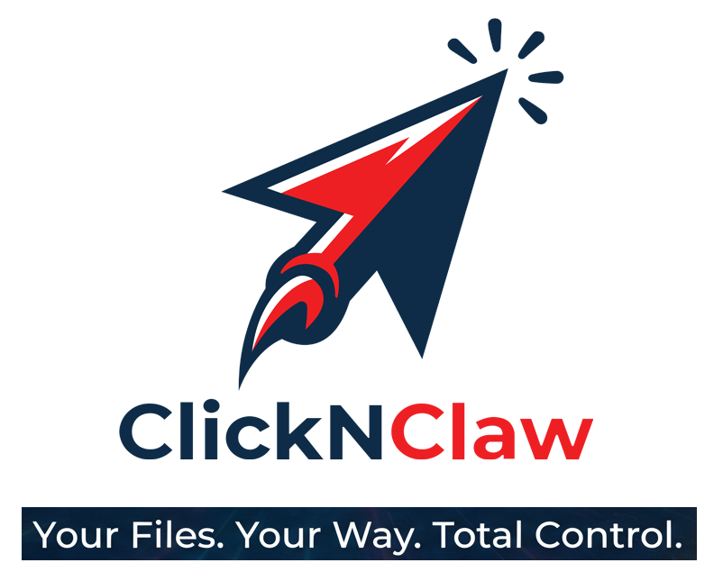

<p align="center">
  
</p>

<p align="center">
  <strong>Your AI Command Center.</strong><br>
  <em>Multi-Agent Orchestration · Smart File Management · Crypto Trading · Cross-Platform Desktop</em>
</p>

<p align="center">
  
  &nbsp;
  
  &nbsp;
  
</p>

<p align="center">
  <a href="https://github.com/ClickNClaw" target="_blank">GitHub</a> ·
  <a href="https://twitter.com/ClickNClaw" target="_blank">Twitter</a> ·
  <a href="https://www.clicknclaw.com" target="_blank">Website</a>
</p>

---

## What is ClickNClaw?

**ClickNClaw** is a cross-platform desktop app that puts AI agents to work on your machine. It orchestrates multiple AI agents, manages your files, generates documents, and — for crypto users — integrates directly with the Solana blockchain.

Think of it as your **personal AI command center**: one interface to control everything from code generation to wallet management, from automated file organization to scheduled tasks running 24/7.

---

## Core Capabilities

### 🤖 Multi-Agent Orchestration

ClickNClaw doesn't lock you into one AI. It detects and orchestrates **multiple agents** through a unified interface.

- **Built-in AI agent** — works immediately, no CLI setup needed
- **Auto-detects CLI agents** — Claude Code, Codex, Qwen Code, OpenClaw, Goose AI, and 12+ more
- **Parallel sessions** — run multiple agents simultaneously with independent context
- **MCP tool sharing** — configure MCP tools once, all agents access them automatically
- **20+ AI models supported** — Gemini (free), Claude, GPT, DeepSeek, Ollama (local), and more

### 📁 Smart File Management & Document Generation

Your AI agents aren't just chatbots — they **operate directly on your files**.

- **Automated file operations** — batch rename, organize, classify, merge files
- **Document generation** — create PPT, Word, Excel, Markdown with AI
- **Preview panel** — 10+ format preview (PDF, Excel, code, images, HTML) without switching apps
- **Version history** — track file changes with Git-based history
- **Data analysis** — AI-powered Excel processing, report beautification, and insights

### 🎯 14+ Specialized Assistants

Ready-to-use assistants for specific tasks:

| Assistant | What It Does |
|-----------|-------------|
| ⚡ **Solana Alpha Expert** | Wallet management, token trading, MEV protection |
| 🤝 **Cowork** | Autonomous task execution with file operations |
| 🎨 **UI/UX Pro Max** | Professional design with 57 styles, 95 palettes |
| 📊 **PPTX Generator** | Create professional presentations |
| 📋 **Planning with Files** | Manus-style persistent planning |
| 📈 **Beautiful Mermaid** | Flowcharts, sequence diagrams |
| 🎮 **3D Game** | Single-file 3D game generation |
| 📖 **Story Roleplay** | Immersive character-driven stories |
| + 6 more... | |

Create your own assistants with custom rules and skills.

### 🌐 Access From Anywhere

- **WebUI** — access from phone, tablet, or any browser (LAN or remote)
- **Telegram / Lark / DingTalk** — chat with your agents from messaging apps
- **Scheduled tasks (Cron)** — automate tasks to run 24/7 on autopilot
- **QR code login** — quick mobile access

### ⚡ Solana & Crypto Integration

For crypto traders and Web3 developers:

- **Multi-wallet management** — create, import, manage Solana wallets
- **Token swaps** — Jupiter Aggregator for best routes
- **MEV protection** — Jito bundles to prevent sandwich attacks
- **Real-time prices** — live tracking via Jupiter & Helius APIs
- **Encrypted vault** — private keys encrypted with AES-256-GCM, never leave your device

---

## Security

| Principle | Implementation |
|-----------|----------------|
| **Local-first** | All data stored locally in SQLite. Nothing uploaded to external servers |
| **Encrypted keys** | Crypto keys encrypted with AES-256-GCM in a separate vault file |
| **Process isolation** | Sensitive data never reaches the renderer process or AI models |
| **User confirmation** | Every on-chain transaction requires explicit approval |

---

## Quick Start

### Requirements

- macOS 10.15+ / Windows 10+ / Linux (Ubuntu 18.04+)
- 4GB+ RAM, 500MB+ storage

### Install

```bash
# macOS
brew install clicknclaw
```

Or download from [GitHub](https://github.com/ClickNClaw).

### Get Started

1. **Install** ClickNClaw
2. **Sign in** with Google or enter your API key
3. **Start working** — AI agents are ready immediately

---

## Development Status

| Feature | Status |
|---------|--------|
| Built-in AI Agent | ✅ Live |
| Multi-Agent Orchestration | ✅ Live |
| File Management & Preview | ✅ Live |
| 14+ Assistants | ✅ Live |
| WebUI & Telegram | ✅ Live |
| Scheduled Tasks (Cron) | ✅ Live |
| Solana Expert Assistant | ✅ Live |
| Wallet Vault (encrypted) | 🔧 In Progress |
| Jupiter Swap Integration | 🔧 In Progress |
| Portfolio Dashboard | 📋 Planned |

---

## Built With

**Electron** · **React** · **TypeScript** · **UnoCSS** · **Arco Design** · **Solana Web3.js** · **Jupiter & Helius APIs**

---

## Contact

- **Twitter:** [@ClickNClaw](https://twitter.com/ClickNClaw)
- **GitHub:** [github.com/ClickNClaw](https://github.com/ClickNClaw)
- **Website:** [clicknclaw.com](https://www.clicknclaw.com)

---

<p align="center">
  <strong>ClickNClaw</strong> — Your AI Command Center. 🦀
</p>
